# Finsteps Editor Requirements

This document describes all requirements for the Finsteps Mermaid Live Editor example.

## Overview

The Finsteps Editor is a live editing environment that allows users to create Mermaid diagrams and define interactive presentations using the MPD (Mermaid Presentation DSL). It provides real-time validation, syntax highlighting, and a live preview with full presentation controls.

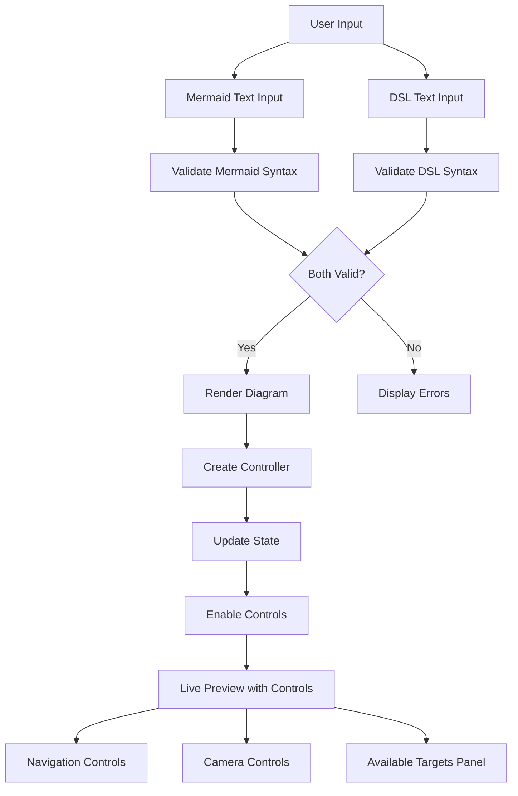

## Requirements

### REQ-001: Layout and UI Structure

The editor MUST have a two-panel layout with a collapsible left sidebar for inputs and a main preview area on the right.

```mermaid
graph LR
    A[Left Sidebar] --> B[Mermaid Input Section]
    A --> C[DSL Input Section]
    A --> D[Collapse Toggle Button]
    E[Main Preview Area] --> F[Diagram Render Zone]
    E --> G[Available Targets Panel]
    E --> H[Navigation Sidebar]
    style A fill:#1e293b
    style E fill:#0f172a
```

**Requirements:**
- Left sidebar MUST be collapsible with animation (collapsing left-to-right)
- Sidebar MUST contain two input sections:
  - Mermaid Diagram Input Section
  - Presentation Framework Instructions (DSL) Input Section
- When collapsed, sidebar SHOULD show only toggle button
- Preview area MUST expand to fill available space when sidebar is collapsed
- All panels MUST support scrolling when content overflows
- Sidebar collapse MUST animate horizontally (left-to-right direction)

**Tests:**
- [`REQ-001: should have left sidebar with two input sections`](../../tests/e2e/editor.spec.ts#L18-L26) - Verifies sidebar structure with Mermaid and DSL input sections
- [`REQ-001/016: should collapse sidebar left-to-right`](../../tests/e2e/editor.spec.ts#L28-L48) - Tests sidebar collapse/expand animation and toggle functionality

### REQ-002: Mermaid Diagram Input

The editor MUST provide a textarea for entering Mermaid diagram syntax.

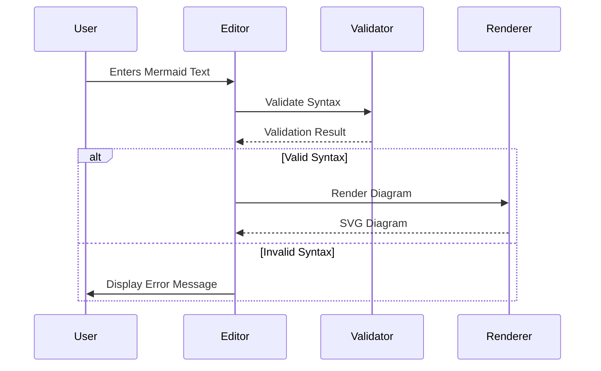

**Requirements:**
- Textarea MUST have syntax validation on input (debounced 300ms)
- Errors MUST be displayed with line numbers when validation fails
- Textarea MUST have a visual error state (CSS class `has-error`)
- Default example diagram MUST be provided on page load
- Validation MUST use Mermaid's `mermaid.parse()` function

**Tests:**
- [`REQ-002: should validate Mermaid syntax`](../../tests/e2e/editor.spec.ts#L50-L63) - Tests syntax validation with error display for invalid Mermaid code
- [`REQ-002: should have default example diagram`](../../tests/e2e/editor.spec.ts#L65-L69) - Verifies default Mermaid diagram is loaded on page initialization

### REQ-003: MPD DSL Input (Simplified)

The DSL Input Section MUST provide a single MPD editor for presentation framework instructions.

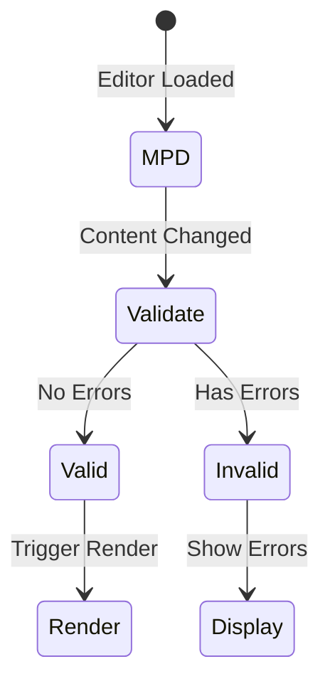

**Requirements:**
- Single MPD editor using CodeMirror
- Real-time syntax validation with error highlighting
- "Generate Presentation" button to auto-create presentation from diagram
- Help text explaining MPD editing
- Error messages displayed below editor

**Tests:**
- [`REQ-003: should have MPD editor (no tabs)`](../../tests/e2e/editor.spec.ts#L71-L78) - Verifies MPD editor exists without tab interface

### REQ-007: Navigation Controls

The editor MUST provide navigation buttons for all defined steps.

```mermaid
flowchart LR
    A[DSL Parsed] --> B[Extract Steps]
    B --> C[Create Navigation Buttons]
    C --> D[User Clicks Button]
    D --> E[Controller.goto(stepId)]
    E --> F[Update Active Button]
    F --> G[Display Step]
```

**Requirements:**
- Navigation buttons MUST be generated from DSL steps
- Each button MUST be labeled with step name or id
- Clicking a button MUST navigate to that step
- Active step button MUST be visually highlighted
- Navigation MUST update when DSL is modified

**Tests:**
- [`REQ-007: navigation buttons should be generated from steps`](../../tests/e2e/editor.spec.ts#L424-L442) - Verifies navigation buttons are created from DSL step definitions
- [`REQ-007: navigation buttons should navigate to step when clicked`](../../tests/e2e/editor.spec.ts#L443-L466) - Tests step navigation when clicking navigation buttons
- [`REQ-007: navigation buttons should highlight active step`](../../tests/e2e/editor.spec.ts#L467-L489) - Verifies active step button highlighting

### REQ-005: Camera Controls

The editor MUST provide camera control buttons for manual diagram navigation.

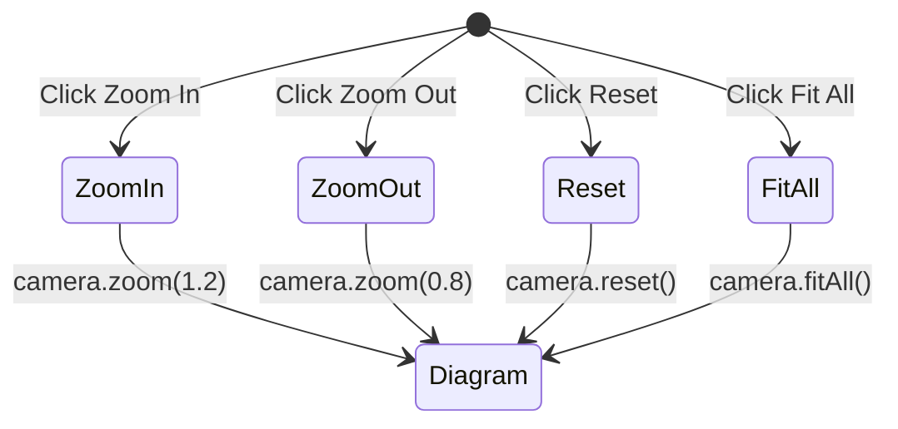

**Requirements:**
- "Zoom In" button MUST call `camera.zoom(1.2)`
- "Zoom Out" button MUST call `camera.zoom(0.8)`
- "Reset" button MUST call `camera.reset()`
- "Fit All" button MUST call `camera.fitAll()`
- Controls MUST be disabled when no diagram is rendered

**Tests:**
- [`REQ-005: camera controls should zoom in when clicked`](../../tests/e2e/editor.spec.ts#L217-L245) - Tests zoom in functionality and viewBox changes
- [`REQ-005: camera controls should zoom out when clicked`](../../tests/e2e/editor.spec.ts#L246-L268) - Tests zoom out functionality
- [`REQ-005: camera controls should reset viewBox when reset clicked`](../../tests/e2e/editor.spec.ts#L269-L296) - Verifies reset button restores initial view
- [`REQ-005: camera controls should fit all when fit-all clicked`](../../tests/e2e/editor.spec.ts#L297-L320) - Tests fit all functionality
- [`REQ-017: camera controls should have visual feedback when disabled`](../../tests/e2e/editor.spec.ts#L179-L194) - Verifies disabled state visual feedback

### REQ-006: Presentation Playback Controls

The editor MUST provide playback controls for stepping through the presentation.

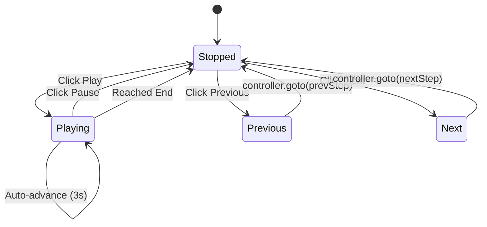

**Requirements:**
- "Play" button MUST auto-advance through steps every 3 seconds
- "Pause" button MUST stop auto-advancement
- "Previous" button MUST navigate to previous step
- "Next" button MUST navigate to next step
- Step indicator MUST show "Step X / Y"
- Playback MUST stop when reaching last step
- Manual navigation MUST stop playback

**Tests:**
- [`REQ-006: playback controls should advance to next step`](../../tests/e2e/editor.spec.ts#L321-L343) - Tests next button navigation
- [`REQ-006: playback controls should go to previous step`](../../tests/e2e/editor.spec.ts#L344-L372) - Tests previous button navigation
- [`REQ-006: playback controls should show step indicator`](../../tests/e2e/editor.spec.ts#L373-L383) - Verifies step indicator format (Step X / Y)
- [`REQ-006: playback controls should play and pause`](../../tests/e2e/editor.spec.ts#L384-L423) - Tests auto-advance play/pause functionality
- [`REQ-017: playback controls should have visual feedback when disabled`](../../tests/e2e/editor.spec.ts#L162-L177) - Verifies disabled state visual feedback

### REQ-007: DSL Generation

The editor MUST be able to generate a starter DSL from a rendered diagram.

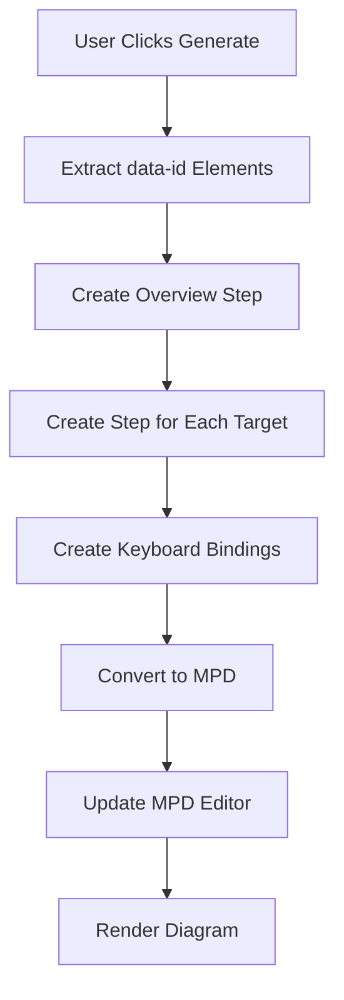

**Requirements:**
- Generation MUST create an "overview" step with `camera.reset()`
- Generation MUST create a step for each targetable element
- Each target step MUST include:
  - `camera.fit()` with padding 60
  - `style.highlight()`
  - `overlay.bubble()` with descriptive text
- Generation MUST create keyboard bindings:
  - ArrowRight → `nav.next`
  - ArrowLeft → `nav.prev`
- Generation MUST create click bindings for navigation buttons
- Generated DSL MUST be converted to MPD format and inserted into editor

**Tests:**
- [`REQ-007: generate presentation button should create MPD from diagram`](../../tests/e2e/editor.spec.ts#L490-L522) - Tests DSL generation from diagram data-ids and MPD conversion

### REQ-005: Export Functionality

The editor MUST allow exporting the current Mermaid diagram and DSL.

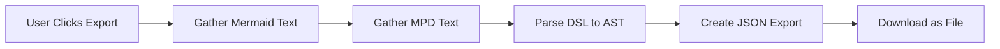

**Requirements:**
- Export MUST include:
  - Mermaid diagram text
  - MPD DSL text
  - Parsed DSL AST (JSON format)
  - Version number
  - Export timestamp
- File MUST be downloaded as JSON with filename: `finsteps-presentation-{timestamp}.json`

**Tests:**
- [`REQ-005: export should download JSON file with correct content`](../../tests/e2e/editor.spec.ts#L523-L565) - Tests file download with correct JSON structure and filename format
- [`REQ-017: export button should be enabled when content exists`](../../tests/e2e/editor.spec.ts#L87-L117) - Verifies export button enablement logic
- [`REQ-017: export button should have visual feedback when disabled`](../../tests/e2e/editor.spec.ts#L119-L140) - Tests disabled state visual feedback

### REQ-009: Import Functionality

The editor MUST allow importing previously exported presentations.

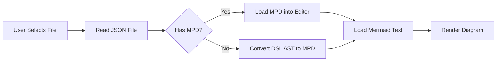

**Requirements:**
- Import MUST support files exported from REQ-005
- Import MUST load Mermaid text into Mermaid input
- Import MUST load MPD text into MPD editor (if available)
- Import MUST fallback to converting DSL AST to MPD if MPD not present
- Import MUST trigger diagram rendering after successful load
- Import errors MUST be displayed to user

**Tests:**
- [`REQ-009: import should load MPD and Mermaid from JSON file`](../../tests/e2e/editor.spec.ts#L566-L611) - Tests importing JSON file with MPD and Mermaid content
- [`REQ-009: import should fallback to DSL AST if MPD not present`](../../tests/e2e/editor.spec.ts#L612-L658) - Verifies fallback to DSL AST conversion when MPD missing
- [`REQ-017: import button should always be enabled`](../../tests/e2e/editor.spec.ts#L80-L85) - Verifies import button is always enabled

### REQ-010: Error Handling and Display

The editor MUST display validation and runtime errors clearly to users.

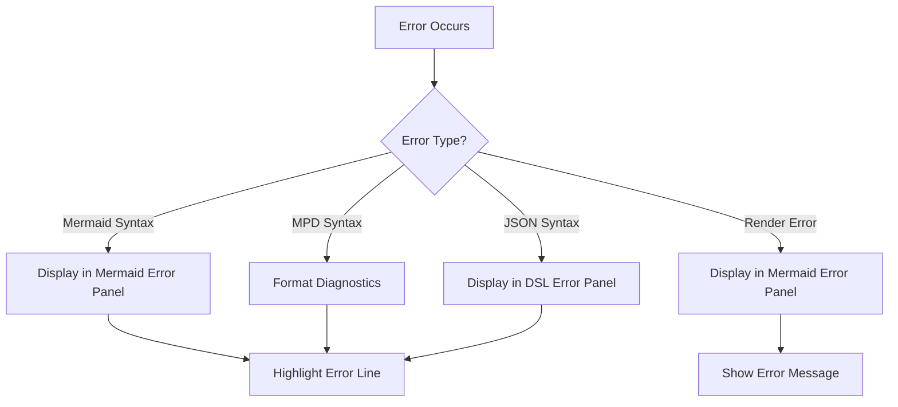

**Requirements:**
- Errors MUST be displayed in dedicated error panels
- Error panels MUST be collapsible/expandable
- MPD errors MUST use `formatDiagnostics()` for consistent formatting
- Error messages MUST include:
  - Error message text
  - Line number (when available)
  - Column number (when available)
  - Error code (for MPD diagnostics)
- Editor lines with errors MUST be visually highlighted
- Errors MUST clear when fixed

**Tests:**
- [`REQ-010: should display Mermaid syntax errors with line numbers`](../../tests/e2e/editor.spec.ts#L659-L679) - Tests Mermaid error display with line numbers and error class
- [`REQ-010: should display MPD syntax errors with formatted diagnostics`](../../tests/e2e/editor.spec.ts#L680-L701) - Verifies MPD error formatting using formatDiagnostics
- [`REQ-010: errors should clear when fixed`](../../tests/e2e/editor.spec.ts#L702-L721) - Tests error clearing when syntax is corrected

### REQ-012: Drag-to-Pan

The diagram MUST support drag-to-pan functionality by default.

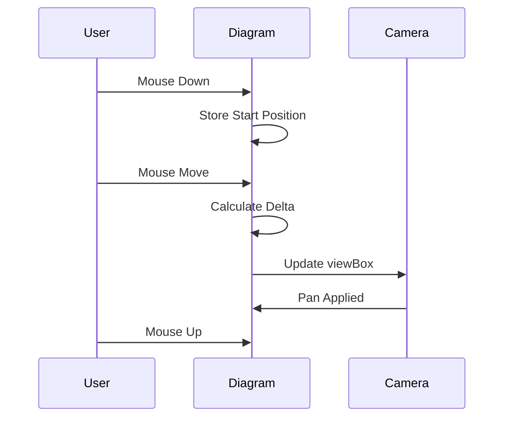

**Requirements:**
- Drag-to-pan MUST be enabled by default on diagram SVG
- Panning MUST use mouse/touch drag gestures
- Panning MUST update SVG `viewBox` dynamically
- Panning direction MUST match drag direction (right drag = right pan)

**Tests:**
- [`REQ-012: should support drag-to-pan on diagram`](../../tests/e2e/editor.spec.ts#L722-L761) - Tests mouse drag-to-pan functionality and viewBox updates

### REQ-016: Sidebar Collapse

The left sidebar MUST be collapsible with smooth horizontal animation (collapsing left-to-right).

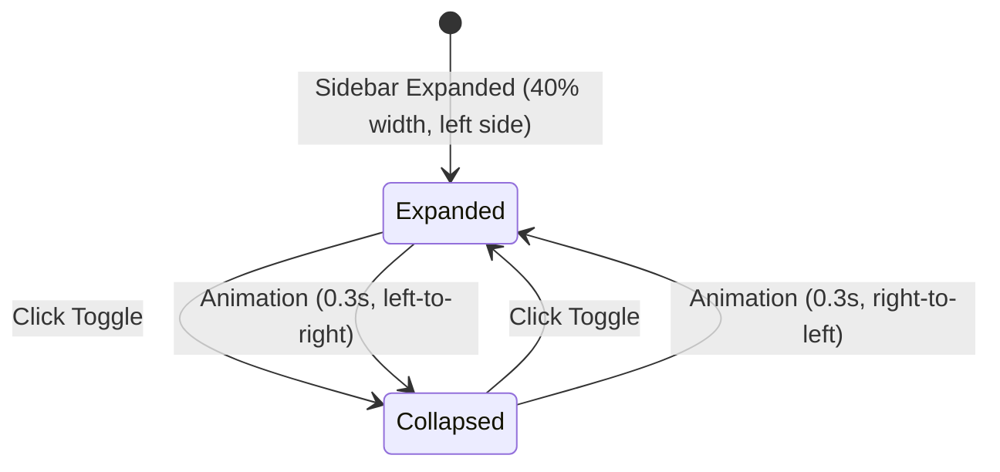

**Requirements:**
- Toggle button MUST be visible in collapsed state
- Collapse animation MUST be smooth (0.3s transition) and horizontal
- Collapse MUST move from left to right (sidebar shrinks leftward)
- Icon MUST rotate to indicate state
- When collapsed, sidebar content MUST be hidden
- Preview area MUST expand to fill space when collapsed
- Toggle button MUST remain accessible when collapsed

**Tests:**
- [`REQ-001/016: should collapse sidebar left-to-right`](../../tests/e2e/editor.spec.ts#L28-L48) - Tests sidebar collapse/expand animation and toggle functionality

### REQ-013: Real-time Updates

The diagram MUST update in real-time as users edit Mermaid or DSL text.

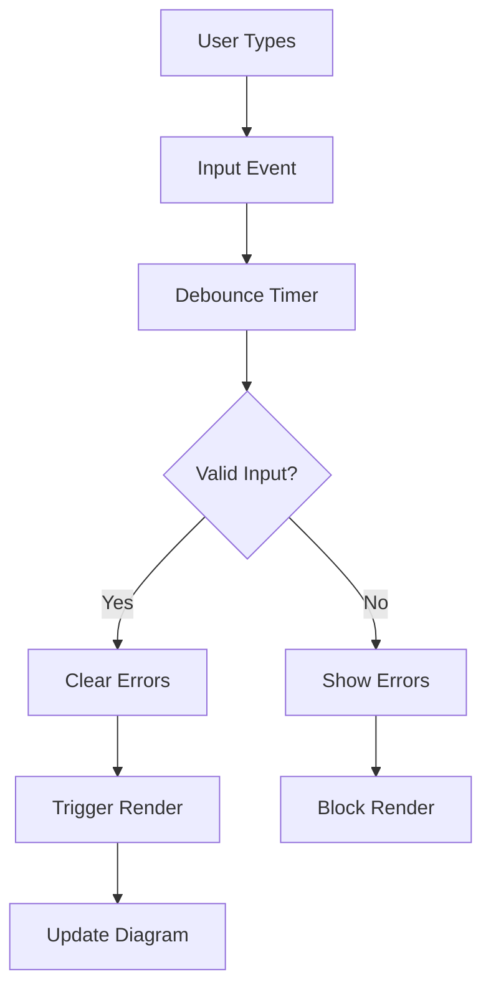

**Requirements:**
- Updates MUST be debounced to prevent excessive rendering
- Mermaid updates: 300ms debounce for validation, 500ms for rendering
- MPD updates: 300ms debounce for validation, 500ms for rendering
- Only valid inputs MUST trigger diagram rendering
- Invalid inputs MUST display errors but not block editing

**Tests:**
- [`REQ-013: should debounce Mermaid validation (300ms)`](../../tests/e2e/editor.spec.ts#L762-L778) - Tests debouncing prevents excessive validation calls
- [`REQ-013: should update diagram in real-time when valid`](../../tests/e2e/editor.spec.ts#L779-L794) - Verifies real-time diagram updates with valid input

### REQ-014: Initialization

The editor MUST initialize all components on page load.

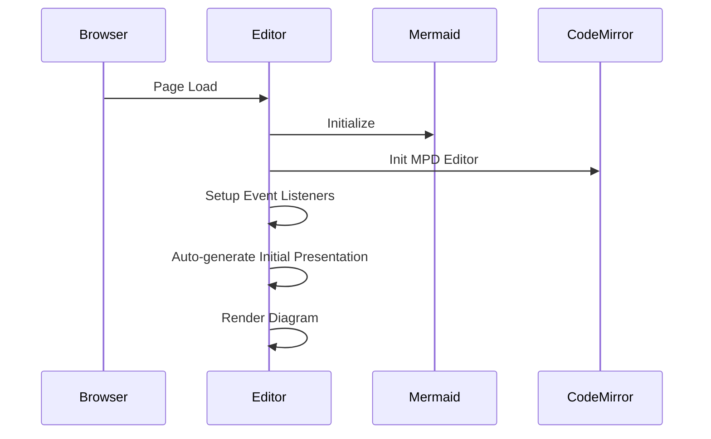

**Requirements:**
- Mermaid MUST be initialized with dark theme
- CodeMirror editors MUST be initialized with proper configuration
- Event listeners MUST be attached to all interactive elements
- Initial presentation MUST be auto-generated if Mermaid text exists
- Diagram MUST render after initialization completes

**Tests:**
- [`REQ-014: should initialize Mermaid with dark theme`](../../tests/e2e/editor.spec.ts#L795-L809) - Verifies Mermaid initialization
- [`REQ-014: should initialize CodeMirror editor`](../../tests/e2e/editor.spec.ts#L810-L821) - Tests CodeMirror MPD editor initialization
- [`REQ-014: should auto-generate initial presentation`](../../tests/e2e/editor.spec.ts#L822-L836) - Verifies auto-generation of presentation on page load

### REQ-015: Step Change Event Handling

The editor MUST update UI state when presentation steps change.

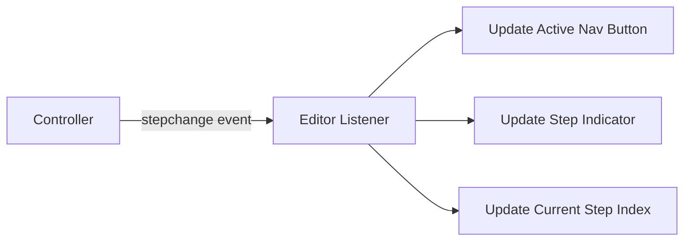

**Requirements:**
- Editor MUST listen to `controller.on("stepchange")` events
- Active navigation button MUST update on step change
- Step indicator display MUST update on step change
- Current step index MUST be tracked for playback controls

**Tests:**
- [`REQ-015: should update active nav button on step change`](../../tests/e2e/editor.spec.ts#L837-L857) - Tests navigation button updates on step change
- [`REQ-015: should update step indicator on step change`](../../tests/e2e/editor.spec.ts#L858-L879) - Verifies step indicator updates reflect current step
- [`REQ-015: should track current step index for playback`](../../tests/e2e/editor.spec.ts#L880-L908) - Tests step index tracking for playback controls

### REQ-016: Reactive State Tracking

The editor MUST track application state reactively and update the UI accordingly.

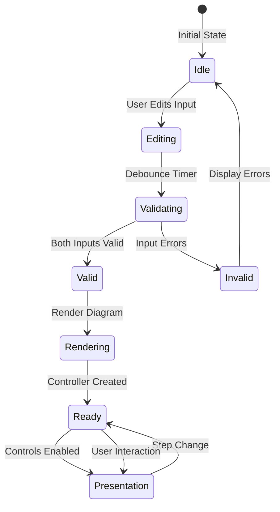

**Requirements:**
- Editor MUST maintain a centralized state object tracking:
  - Mermaid text content and validity
  - DSL text content and validity
  - Current diagram controller instance
  - Current step index
  - Rendering status (idle, rendering, ready, error)
  - Available targets from diagram
- State changes MUST trigger UI updates reactively
- All UI components MUST reflect current state accurately
- State MUST be updated before triggering UI updates
- Invalid state MUST prevent presentation controls from being enabled
- Valid state MUST enable presentation controls automatically

**Implementation:**
- State object: [`examples/editor/editor.js:27-54`](https://github.com/cablepull/finsteps/blob/4b5997cf80c5128503a412de6aace2d597b39c48/examples/editor/editor.js#L27-L54)
- State update function: [`examples/editor/editor.js:74-95`](https://github.com/cablepull/finsteps/blob/4b5997cf80c5128503a412de6aace2d597b39c48/examples/editor/editor.js#L74-L95)
- State tracking in render: [`examples/editor/editor.js:1042-1050`](https://github.com/cablepull/finsteps/blob/4b5997cf80c5128503a412de6aace2d597b39c48/examples/editor/editor.js#L1042-L1050)

**Tests:**
- [`REQ-016/017: controls should update when content changes`](../../tests/e2e/editor.spec.ts#L196-L214) - Verifies reactive state updates trigger UI changes

### REQ-017: Control Enablement Based on State

The editor MUST enable/disable controls based on the current application state.

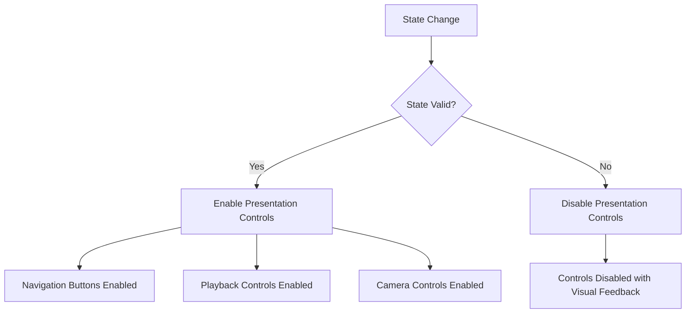

**Requirements:**
- Navigation buttons MUST be enabled only when:
  - Diagram is successfully rendered
  - Controller instance exists
  - DSL contains valid steps
- Playback controls MUST be enabled only when:
  - Navigation buttons are enabled
  - At least one step is defined
- Camera controls MUST be enabled only when:
  - Diagram is successfully rendered
  - Controller instance exists
- Export button MUST be enabled when:
  - At least Mermaid text or DSL text is present
- Import button MUST always be enabled
- Disabled controls MUST provide visual feedback (grayed out, cursor not-allowed)
- Control state MUST update immediately when state changes

**Implementation:**
- Control enablement function: [`examples/editor/editor.js:100-157`](https://github.com/cablepull/finsteps/blob/4b5997cf80c5128503a412de6aace2d597b39c48/examples/editor/editor.js#L100-L157)
- Control state initialization: [`examples/editor/editor.js:254`](https://github.com/cablepull/finsteps/blob/4b5997cf80c5128503a412de6aace2d597b39c48/examples/editor/editor.js#L254)
- Navigation button updates trigger control state: [`examples/editor/editor.js:1244`](https://github.com/cablepull/finsteps/blob/4b5997cf80c5128503a412de6aace2d597b39c48/examples/editor/editor.js#L1244)

**Tests:**
- [`REQ-017: import button should always be enabled`](../../tests/e2e/editor.spec.ts#L80-L85) - Verifies import button is always enabled
- [`REQ-017: export button should be enabled when content exists`](../../tests/e2e/editor.spec.ts#L87-L117) - Tests export button enablement based on content
- [`REQ-017: export button should have visual feedback when disabled`](../../tests/e2e/editor.spec.ts#L119-L140) - Verifies disabled state visual feedback
- [`REQ-017: navigation buttons should have visual feedback when disabled`](../../tests/e2e/editor.spec.ts#L142-L160) - Tests navigation buttons disabled state
- [`REQ-017: playback controls should have visual feedback when disabled`](../../tests/e2e/editor.spec.ts#L162-L177) - Verifies playback controls disabled state
- [`REQ-017: camera controls should have visual feedback when disabled`](../../tests/e2e/editor.spec.ts#L179-L194) - Tests camera controls disabled state
- [`REQ-016/017: controls should update when content changes`](../../tests/e2e/editor.spec.ts#L196-L214) - Verifies control state updates reactively


## Implementation Notes

- The editor uses CodeMirror 5 for syntax highlighting
- Mermaid v10 is used for diagram rendering
- The Finsteps framework provides `presentMermaid`, `parseMPD`, and `formatDiagnostics`
- All async operations MUST handle errors gracefully
- The editor MUST work in modern browsers (ES6+ support required)
